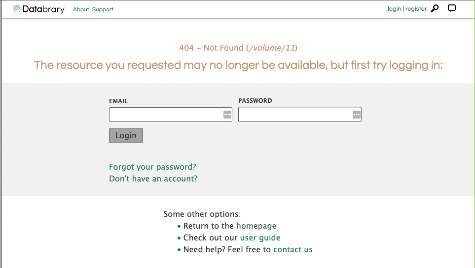

```{r setup, include=FALSE}
knitr::opts_chunk$set(echo = FALSE,
                      fig.align = "center")
```

# Purpose

This document describes the protocol for the Databrary Volume Survey project.

# Project goals

1. Evaluate all shared volumes on Databrary to determine what information has been shared.

2. Generate a data file, in the form of a Google spreadsheet, that can be used to summarize the findings.

3. Determine which shared volumes lack critical information, lack clarity, or which could be improved in some way.

# Protocol steps

## Open the Google sheet and Databrary

The data sheet can be found at the following URL:

<https://docs.google.com/spreadsheets/d/1WXY82Xi4AGbNkClkqnUxCnxcrdnwLKU6Ki-9L9e3TbU/edit?usp=sharing>

In a separate window, open <https://databrary.org/volume/1>.

**Suggestion**: Position the windows side by side.

ADD SCREEN SHOT HERE

## Visit a set of volumes and record the data

- Do no more than 10 at a time.
- Visit in sequential order, e.g., `volume_id` 11-20.
- Visit the URL on Databrary: `https://databrary.org/volume/<volume_id>` substituting the value for the volume you are visiting with `<volume_id>`, for example: <https://databrary.org/volume/11>.

### Data fields

`coder`: The initials of the person coding the data, e.g., 'rog'.

`volume_id`: An integer indicating the volume identifier. Do not use a formula for this.

`descriptive_title`: Enter `yes` if the title describes the dataset, `no` if it does not, and `NA` if the volume cannot be found--you get a '404 -- Not Found' error.

```{r}

```

`full_description`: Does the volume have a paragraph that describes the dataset fully?
