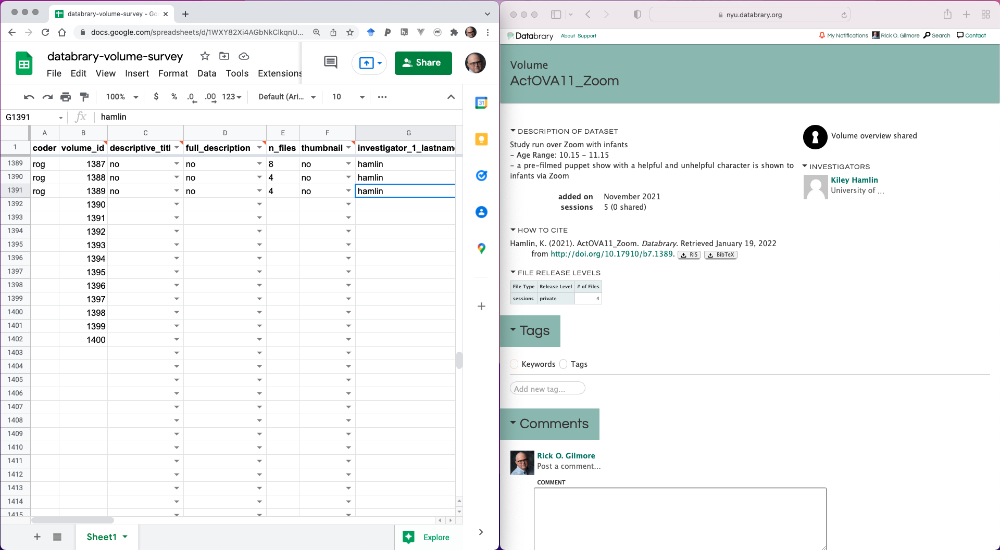
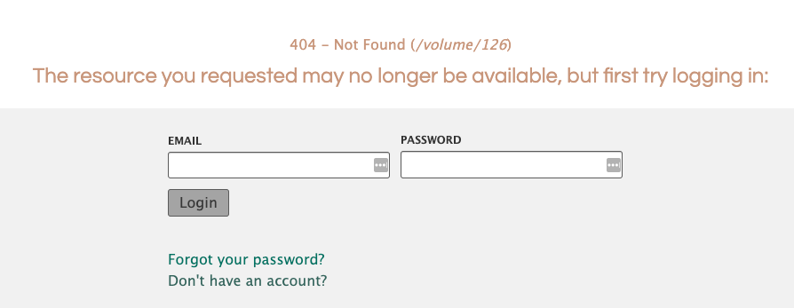

```{r setup, include=FALSE}
knitr::opts_chunk$set(echo = FALSE,
                      fig.align = "center",
                      out.width = "800px")
```

# Purpose

This document describes the protocol for the Databrary Volume Survey project.

# Project goals

1. Evaluate all shared volumes on Databrary to determine what information has been shared.

2. Generate a data file, in the form of a Google spreadsheet, that can be used to summarize the findings.

3. Determine which shared volumes lack critical information, lack clarity, or which could be improved in some way.

# Protocol steps

## Open the Google sheet and Databrary

The data sheet can be found at the following URL:

<https://docs.google.com/spreadsheets/d/1WXY82Xi4AGbNkClkqnUxCnxcrdnwLKU6Ki-9L9e3TbU/edit?usp=sharing>

In a separate window, open <https://databrary.org/volume/1>.

**Suggestion**: Position the windows side by side.

```{r}

```

## Visit a set of volumes and record the data

- Do no more than 10 at a time.
- Visit in sequential order, e.g., `volume_id` 11-20.
- Visit the URL on Databrary: `https://databrary.org/volume/<volume_id>` substituting the value for the volume you are visiting with `<volume_id>`, for example: <https://databrary.org/volume/11>.

### Stage 1: Data fields

`coder`: The initials of the person coding the data, e.g., 'rog'.

ars: Andrea Seisler</br>
dbw: Bowen Deng</br>
kmj: Kavya Jhaveri</br>
kzm: Kayla Moniger</br>
mhb: Maggie Burke</br>
rog: Rick Gilmore</br>
sr: Shahir Reyes</br>
svp: Belle Peterson</br>

`volume_id`: An integer indicating the volume identifier. Do not use a formula for this.

`descriptive_title`: Enter `yes` if the title describes the dataset, `no` if it does not, and `NA` if the volume cannot be found--you get a '404 -- Not Found' error.

```{r}

```

`full_description`: Does the volume have a paragraph that describes the dataset fully? `yes`, `no` (some descriptive explanation) or `NA` (no descriptive explanation of data exists) are acceptable values. If there _is_ a thumbnail image or video, but it is blank, or broken, or does not play, indicate that in the comments section.

ADD MORE FIELDS FROM DATA SHEET

### Stage 2: Data fields

For all of the volumes that have a '404 -- Not Found' error, ARS will add the Stage 2 data fields by logging into Databrary as Admin.

`investigator_1_lastname`: Last name of the first investigator listed on the volume.  

`investigator_1_party_id`: party ID of the first investigator listed on the volume. Click on the investigator name then you will see the party ID number. e.g. Rick Gilmore <https://nyu.databrary.org/party/6>. 

`comments`:
